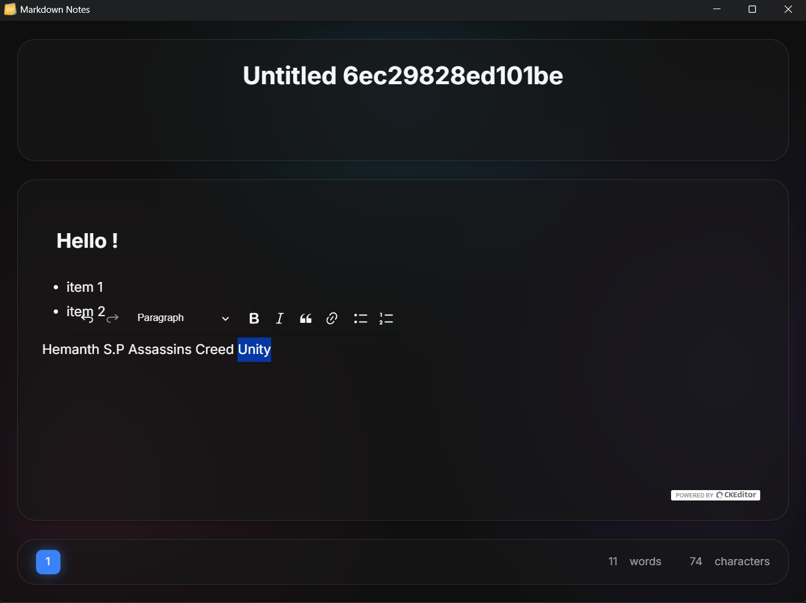

# Markdown Notes v1.0


A modern, glassmorphism-styled markdown editor built with Tauri.

## Features

- **Modern UI**: A stunning Glassmorphism Bento Grid layout with animated backgrounds and smooth transitions.
- **Themes**: Choose from multiple pre-built themes:
    - **Glass (Default)**: Sleek dark mode with subtle transparency.
    - **Midnight**: Deep purple and indigo tones.
    - **Nature**: Dark green and lime accents.
    - **Coffee**: Warm, earthy tones for a cozy writing experience.
- **Distraction-Free**: Clean interface with floating panels for maximum focus.
- **Fast & Lightweight**: Built on Rust and Tauri for blazing performance.

<br>

This is a **prototype**, now enhanced with a premium design system.

# How to run?

## Windows

Run the `Markdown Notes_[version]_x64_en-US.msi` msi installer or run the `Markdown Notes_[version]_x64-setup.exe` installer included in the releases section.

## GNU/Linux

### Debian and/or Ubuntu

Install the `.deb` version of the package from the releases section.

### AppImage and raw linux

For any other GNU/Linux distribution you can use the `.AppImage` or run the `raw linux` version from the the releases section.

Note: You might need to make them executable by running `chmod +x Markdown Notes.AppImage` or `chmod +x Markdown-Notes-linux`.

# Manual compilation

To build the project manually:

```bash
npm install
npm run tauri build
```

# On first startup

1. Run the installed application.
2. Press `CTRL` + `P` to open the command palette.
3. Press `CTRL` + `ALT` + `S` to open the Theme Selector and try out the new **Glass**, **Midnight**, or **Nature** themes!

# Themes

### Premade

You can press `CTRL` + `ALT` + `S` to open the Theme Selector.

### Creating

You can duplicate the `src/themes/default.css` and modify its CSS variables. The new design system uses variables like `--glass-bg`, `--glass-border`, `--accent-color`, etc.

# Known bugs

1. Changing the title of any file to a duplicate causes a panic & `config.json` to mess up. For the time being, avoid naming files the same. In case this happens, nuke `config.json` by emptying all arrays & restart the software.

